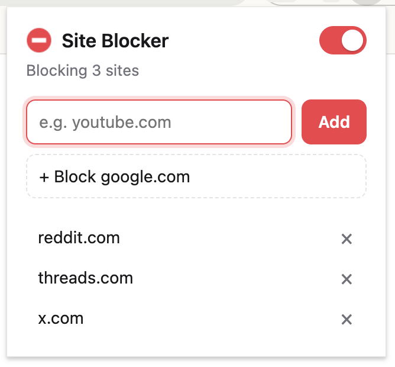

# Site Blocker - Chrome Extension



A small Chrome extension that blocks the websites you choose.

- **One switch** turns blocking on or off.
- **Add or remove sites** from the popup. Type `youtube.com`, paste a full URL, or click **Block \<current site\>**.
- Blocking a site also blocks its subdomains (`youtube.com` covers `m.youtube.com`).
- When blocking is on, any visit to a blocked site shows a "This site is blocked" page. That includes tabs that are already open.

## Install (developer mode)

1. Open `chrome://extensions`.
2. Turn on **Developer mode** (top right).
3. Click **Load unpacked** and select this folder.
4. Pin **Site Blocker** from the puzzle-piece menu so the switch is one click away.

After you edit the code, click the reload icon on the extension's card in `chrome://extensions`.

## How it works

Settings live in `chrome.storage.local` as `{ enabled, sites }`. The popup only writes settings. The background service worker listens for changes and keeps one [`declarativeNetRequest`](https://developer.chrome.com/docs/extensions/reference/api/declarativeNetRequest) rule in sync with them. The rule sends requests for blocked domains to `src/blocked.html` before the site loads.

The toolbar icon turns grey when blocking is off.

## Project layout

```
manifest.json         Extension manifest (Manifest V3)
src/background.js     Service worker: syncs the blocking rule, blocks open tabs
src/popup.*           Toolbar popup: on/off switch, add/remove sites
src/blocked.*         Page shown in place of a blocked site
src/shared.js         Settings and domain helpers used by all of the above
icons/                Toolbar icons (red = on, grey = off)
scripts/make_icons.py Regenerates the icons (standard-library Python)
```

There is no build step. The folder is the extension.
