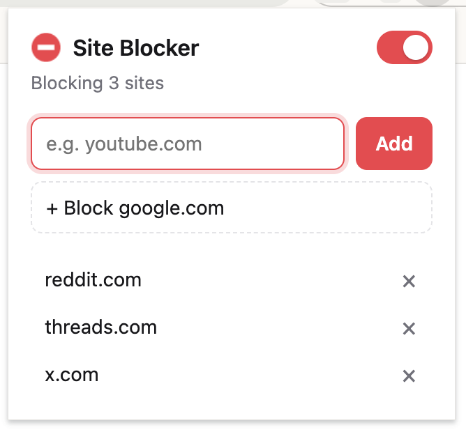

# Site Blocker - Chrome Extension



A small Chrome extension that blocks the websites you choose.

- **Add or remove sites** from the popup. Type `youtube.com`, paste a full URL, or click **Block \<current site\>**.
- Blocking a site also blocks its subdomains (`youtube.com` covers `m.youtube.com`).
- Any visit to a blocked site shows a "This site is blocked" page. That includes tabs that are already open.
- **Focus earns breaks.** Every 6 minutes that blocking is on while you're at the computer earns 1 minute of break. You can save up to 10 minutes, so a morning of focus can't pay for an afternoon off. Time doesn't count while the computer is idle (no keyboard or mouse input for 5 minutes) or locked, which usually covers asleep too, or while Chrome is closed.
- **Breaks start right away.** Once you've saved at least a minute, click **Take it** in the popup, flip the switch off, or click **Take N minutes off** on a blocked page. The break uses everything you've saved, and blocking turns back on when it's over. Come back early (**Back to work**, or flip the switch on) and the rest stays saved for next time.
- **Borrowing is for when it can't wait.** With no break saved, the blocked page offers **Borrow time**: say what you need the site for, and pick 2, 5 or 10 minutes. Borrowed time is paid back with focus before your next break, and you can't owe more than 15 minutes. When a borrowed break runs out, the blocked page reminds you what it was for.
- **Removing a site takes 5 minutes**, with a countdown and a Cancel button. The site stays blocked until the countdown ends. Adding sites happens right away.
- To change the numbers, edit `FOCUS_PER_BREAK`, `MAX_SAVED_MS`, `MIN_BREAK_MS`, `BORROW_OPTIONS_MS`, `MAX_BORROWED_MS` and `REMOVE_DELAY_MS` in `src/shared.js`.

## Install (developer mode)

1. Open `chrome://extensions`.
2. Turn on **Developer mode** (top right).
3. Click **Load unpacked** and select this folder.
4. Pin **Site Blocker** from the puzzle-piece menu so the switch is one click away.

After you edit the code, click the reload icon on the extension's card in `chrome://extensions`.

## How it works

Settings live in `chrome.storage.local` as `{ enabled, sites, enableAt, removeAt, earned, spent, focusSince, focusUntil, reason }`. The background service worker listens for changes and keeps one [`declarativeNetRequest`](https://developer.chrome.com/docs/extensions/reference/api/declarativeNetRequest) rule in sync with them. The rule sends requests for blocked domains to `src/blocked.html` before the site loads.

Break time is kept as two running totals: `earned` (all the break time ever earned) and `spent` (all the break time ever taken). What's saved is the difference, and it goes negative while borrowed time is being paid back. Only the worker writes `earned`, and only the popup and the blocked page write `spent`, so neither side can overwrite an update the other just made.

Focus time is counted lazily: nothing runs while it adds up. The focus clock runs while blocking is on and someone is at the computer, and `focusSince` marks where the time not yet counted began. The popup, the blocked page and the break buttons all work out the saved break as `earned - spent` plus a sixth of the time since `focusSince`. `focusUntil` is when the saved break will be full, worked out when the clock starts, so focus after that earns nothing, even if a break is taken before the worker gets to count it. The worker counts the time into `earned` when the clock stops: when a break starts, or when [`chrome.idle`](https://developer.chrome.com/docs/extensions/reference/api/idle) reports the computer idle or locked. Coming back starts the clock again. It also counts the time so far, at most once a minute, when a tab loads or is switched to or a Chrome window gains or loses focus. Nothing reports Chrome closing, so when Chrome starts again (`chrome.storage.session` is empty then), the time not yet counted is dropped: at most the time since Chrome was last in use. A computer that sleeps without locking isn't seen as away, so that time counts. Counting writes only `earned`, `focusSince` and `focusUntil`, and changes to those alone don't make the worker re-apply the blocking rule.

A break is two changes saved together: `enabled` goes to false, and `enableAt` is set to when the break ends. Its whole length is added to `spent` up front, and coming back early takes back what's left. `removeAt` says when each site leaves the list. The worker makes each timed change when its time comes, using an alarm to wake up. If Chrome was closed at that time, the worker makes the change the next time Chrome starts. Alarms can go off late, because Chrome's timers stop while the computer sleeps. So the popup and the blocked page also ask the worker to make the change once a countdown they show has run out. While a change is pending, a repeating alarm goes off once a minute as a backstop for a one-shot alarm that never fires, and the worker checks whether any change is overdue whenever a tab loads or is switched to, or a Chrome window takes focus.

The toolbar icon turns grey when blocking is off.

## Project layout

```
manifest.json         Extension manifest (Manifest V3)
src/background.js     Service worker: syncs the blocking rule, blocks open tabs, counts focus, ends breaks
src/popup.*           Toolbar popup: break switch, saved break, add/remove sites
src/blocked.*         Page shown in place of a blocked site: take or borrow a break from there
src/shared.js         Settings, break and countdown helpers, domain helpers used by all of the above
icons/                Toolbar icons (red = on, grey = off)
scripts/make_icons.py Regenerates the icons (standard-library Python)
```

There is no build step. The folder is the extension.
